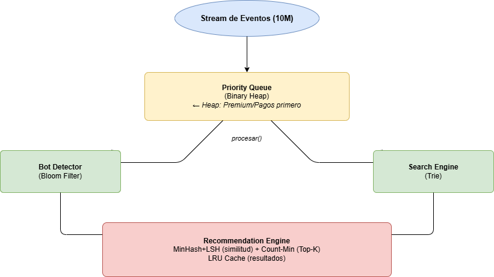

# Sistema Inteligente de Análisis y Procesamiento de Streams de Datos

**Curso:** Estructuras de Datos y Algoritmos
**Programa:** Maestría en Ciencia de Datos e Inteligencia Artificial — UTEC
**Escenario:** Opción A — Plataforma de Streaming de Video (Tipo Netflix/YouTube)

---

## Integrantes
- Armando Fortunato Canales Gomez de La Torre
- Freundt Cuadros Piero Antoniolli
- López Espada, Joshi Azeret Adrián 
- Miranda Barrueto, Renato Alonso
- Trujillo Ramos Diego Alberto

---

## Descripción

Sistema de procesamiento de streams de datos en tiempo real que simula una plataforma de streaming de video. Procesa 10 millones de eventos de usuarios (reproducción, búsqueda, valoración, etc.) usando estructuras de datos avanzadas para garantizar eficiencia algorítmica a escala.

---

## Estructuras Avanzadas Implementadas

| # | Estructura | Módulo | Uso en el sistema |
|---|---|---|---|
| 1 | **Bloom Filter** | `src/structures/bloom_filter.py` | Detección de usuarios duplicados/bots |
| 2 | **Trie (Prefix Tree)** | `src/structures/trie.py` | Autocompletado de búsquedas |
| 3 | **MinHash + LSH** | `src/structures/lsh_minhash.py` | Recomendaciones por similitud de usuarios |
| 4 | **Count-Min Sketch** | `src/structures/count_min_sketch.py` | Top-K videos más vistos en tiempo real |

**Estructuras de soporte:**
- `PriorityQueue` (Binary Heap) — Cola con prioridades para eventos
- `LRUCache` (HashMap + DLL) — Caché inteligente de 1,000 videos

---

## Arquitectura del Sistema

```
Stream de Eventos (10M)
        |
        v
+---------------------+
|   Priority Queue    |  <- Heap: Premium/Pagos primero
|   (Binary Heap)     |
+--------+------------+
         | procesar()
    +----+------------------------------------------+
    |                                               |
    v                                               v
+--------------+                        +------------------+
| Bot Detector |                        |  Search Engine   |
|(Bloom Filter)|                        |     (Trie)       |
+--------------+                        +------------------+
    |                                               |
    v                                               v
+--------------------------------------------------+
|             Recommendation Engine               |
|  MinHash+LSH (similitud) + Count-Min (Top-K)    |
|              LRU Cache (resultados)             |
+--------------------------------------------------+
```

---


## Estructura del Repositorio

```
proyecto-a-e-datos/
├── README.md
├── requirements.txt
├── data/
│   └── generate_dataset.py        # Generador de 10M eventos sintéticos
├── src/
│   ├── main.py                    # Demo completa del sistema
│   ├── structures/
│   │   ├── bloom_filter.py        # Bloom Filter + BotDetector
│   │   ├── trie.py                # Trie + SearchAutocomplete
│   │   ├── lsh_minhash.py         # MinHash + LSH + VideoRecommender
│   │   └── count_min_sketch.py    # Count-Min Sketch + TopKTracker
│   └── system/
│       ├── priority_queue.py      # Priority Queue (Binary Heap)
│       ├── lru_cache.py           # LRU Cache (HashMap + DLL)
│       ├── recommender.py         # Motor de recomendaciones integrado
│       └── stream_processor.py    # Orquestador central del sistema
├── notebooks/
│   ├── 01_bloom_filter.ipynb      # Análisis Bloom Filter vs Hash Set
│   ├── 02_trie.ipynb              # Análisis Trie vs dict
│   ├── 03_lsh_minhash.ipynb       # Análisis LSH y precisión de similitud
│   └── 04_benchmarks.ipynb        # Benchmarks completos + gráficos log-log
└── informe/
    └── Proyecto_Final_Grupo.pdf
```

---

## Benchmarks

Para reproducir los benchmarks de complejidad empírica:

```bash
jupyter notebook notebooks/04_benchmarks.ipynb
```

Los benchmarks miden:
- Tiempo de inserción/consulta para datasets de 1K -> 10M elementos
- Uso de memoria: Bloom Filter vs Hash Set, Trie vs dict, CMS vs Counter
- Gráficos log-log para verificar complejidades teóricas

---

## Resultados Principales

| Estructura | Operación | Complejidad | Memoria (1M elem) |
|---|---|---|---|
| Bloom Filter | Consulta | O(k) aprox O(1) | ~1.2 MB |
| Hash Set | Consulta | O(1) avg | ~40 MB |
| Trie | Autocomplete | O(L + K) | ~85 MB |
| Dict | Búsqueda exacta | O(1) | ~50 MB |
| Count-Min Sketch | Top-K update | O(d) aprox O(1) | ~0.1 MB |
| Counter exacto | Frecuencia | O(1) | ~8 MB |

> Bloom Filter usa 97% menos memoria que Hash Set con solo 1% de tasa de falsos positivos.

---

## Referencias

- Bloom, B. H. (1970). Space/time trade-offs in hash coding with allowable errors. Communications of the ACM.
- Cormode, G., & Muthukrishnan, S. (2005). An improved data stream summary: the count-min sketch. Journal of Algorithms.
- Broder, A. Z. (1997). On the resemblance and containment of documents. Compression and Complexity of Sequences.
- Indyk, P., & Motwani, R. (1998). Approximate nearest neighbors: towards removing the curse of dimensionality. STOC.
- Fredkin, E. (1960). Trie memory. Communications of the ACM.
